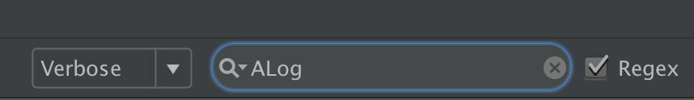
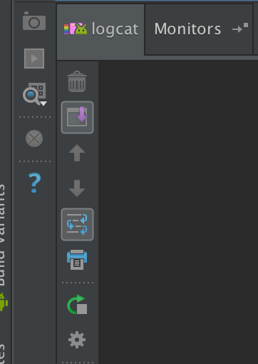

[TOC]

# Android ALog

Android ALog provides :
- Full method count 92
- Thread information
- Class information
- Method information
- Clean output
- Pretty-print for json content
- Pretty-print for new line "\n"
- Jump to source
- LogMessage and LogContent catch

Less Runtime :
- minSdkVersion 9
- gradle or maven
- jar [You can Download just like this Path](https://github.com/MDL-Sinlov/MDL-Android-Repo/raw/master/mvn-repo/mdl/sinlov/android/log/0.0.2/log-0.0.2-jarLib.zip)

> eclipse just use every repo at version `log-x.x.x-jarLib.jar`

Project Runtime:
- Android Studio 2.0
- appcompat-v7:23.4.0
- Gradle 2.10
- com.android.tools.build:gradle:2.0.0

# Last Version Info

- version 0.0.2
- change repo to https://github.com/MDL-Sinlov/MDL-Android-Repo

# Dependency

at root project `build.gradle`

```gradle
repositories {
    maven {
        url 'https://raw.githubusercontent.com/MDL-Sinlov/MDL-Android-Repo/master/mvn-repo/'
    }
    jcenter()
    ...
}
```

in module `build.gradle`

```gradle
dependencies {
    compile 'mdl.sinlov.android:log:0.0.2'
}
```

# Usage

**You must be called once to init Tag. This should be called only once. Best place would be in application class.** 

```java
ALog.initTag();
```

```java
ALog.d("text message");
// String.format
ALog.d("text message %s %d", "world", 5);
```

```java
ALog.d("text message");
ALog.e("text message");
ALog.w("text message");
ALog.v("text message");
ALog.wtf("text message");
ALog.json(YOUR_JSON_DATA_STRING);
ALog.xml(YOUR_XML_DATA_STRING);
```

## With Tag

```java
ALog.t("MyTag").d("Test my tag");
```

## LogLevel setting

```java
// full log
ALog.initTag().logLevel(ALogLevel.FULL);
// release can use this
ALog.initTag().logLevel(ALogLevel.NONE);
// only show warning and error level
ALog.initTag().logLevel(ALogLevel.ONLY_WARNING_ERROR);
// let log show in warning and error for some ROM
ALog.initTag().logLevel(ALogLevel.CHANGE_TO_WARNING_ERROR);
```

# Settings

```java
ALog
  .initTag(YOUR_TAG)                 // default ALog or use just initTag()
  .methodCount(3)                 // default 2
  .hideThreadInfo()               // default shown
  .logLevel(LogLevel.NONE)        // default LogLevel.FULL
  .methodOffset(2)                // default 0
  .logTool(new AndroidLogTool()); // custom log tool, optional
```

> Note: Use LogLevel.NONE for the release versions

# Notes

- Use the filter for a better result



- Make sure that the wrap option is disabled



# Use another log util instead of android.util.log

* Implement IALog
* set it with initTag

```java
.logTool(new MyCustomLogTool())
```

# Pretty print json and xml, ALog.json ALog.xml

Format the json content in a pretty way

```java
ALog.json(YOUR_JSON_DATA_STRING);
ALog.xml(YOUR_XML_DATA_STRING);
```

# getLog string catch

```java
ALog.getLogMessage();
ALog.getLogContent();
```

**max catch size is 4000 str**

# More Use way

## Method info

Observe the caller methods in the order they are invoked and also thread information.

```java
void methodA(){
   methodB();
}
void methodA(){
   ALog.d("Test");
}
```

Both method information will be shown in the order of invocation.

## Change method count (Default: 2)

All logs

```java
ALog.initTag().setMethodCount(1);
```

Log based

```java
ALog.t(1).d("text message");
```

## Change method stack offset (Default: 0)
To integrate ALog with other libraries, you can set the offset in order to avoid that library's methods.

```java
ALog.initTag().setMethodOffset(5);
```

## Hide thread information

```java
ALog.initTag().setMethodCount(1).hideThreadInfo();
```

## Only show the message
```java
ALog.initTag().setMethodCount(0).hideThreadInfo();
```

###License

---

Copyright 2016 sinlovgm@gmail.com

Licensed under the Apache License, Version 2.0 (the "License");
you may not use this file except in compliance with the License.
You may obtain a copy of the License at

   http://www.apache.org/licenses/LICENSE-2.0

Unless required by applicable law or agreed to in writing, software
distributed under the License is distributed on an "AS IS" BASIS,
WITHOUT WARRANTIES OR CONDITIONS OF ANY KIND, either express or implied.
See the License for the specific language governing permissions and
limitations under the License.
